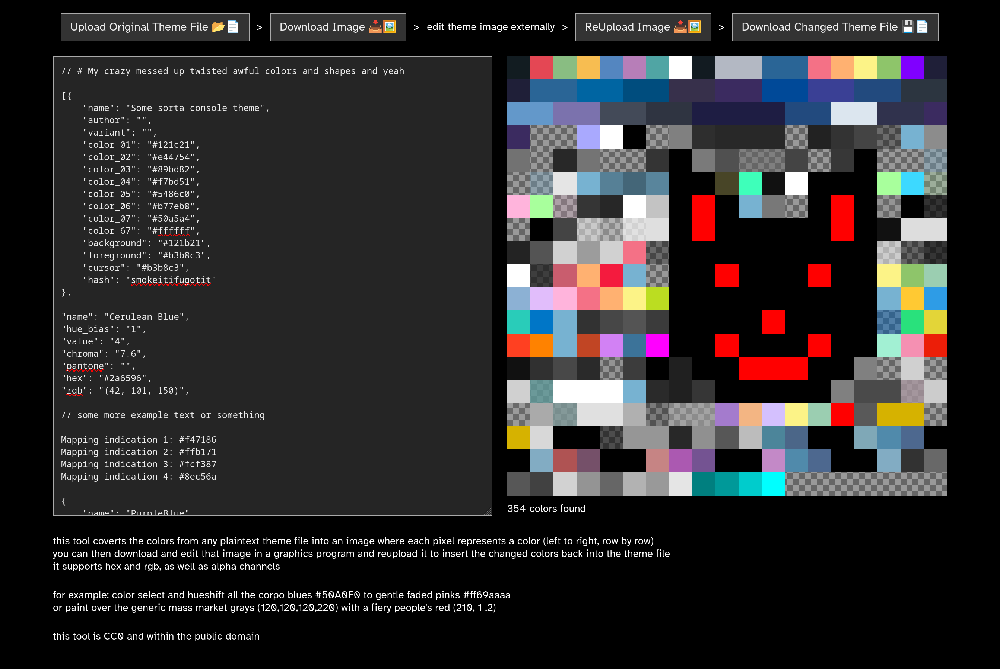

# hextranser
a tool to allow bulk editing of colors in a theme file using image editors

this tool allows the extraction of the colors from any text based theme file into an image where each pixel represents a color 

colors from the file are distributed in the image, one to a each pixel, from left to right, descending row by row

this image can then be downloaded and edited in image manipulation software, 
this is desirable when wanting to do bulk color manipulation operations on large themes, for example: 
- increasing the contrast on sets of colors that are difficult to differentiate
- inverting the image to get the start of a dark mode theme
- hue shifting a specific selection of colors to change a motif
- adjusting saturation so as to make a theme more vibrant
  
the edited image can then be reuploaded to insert the changed colors back into the theme file

it supports both hex and rgb schemes, as well as optional alpha channels for each

it is CC0 and within the public domain, please feel free to host on your own site
